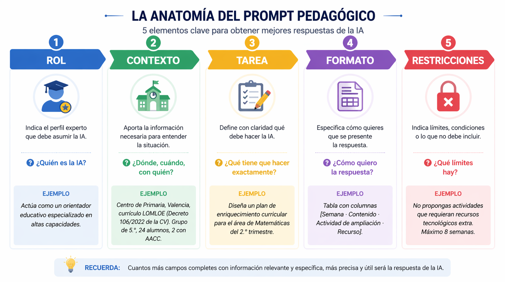

# Bloque 2 · Prompting avanzado y gestión documental
{: .fs-8 }

Domina la fórmula del "Prompt Pedagógico" (Rol + Contexto + Tarea) y aprende a "entrenar" a la IA con el currículo oficial usando NotebookLM.
{: .fs-5 .fw-300 }

---

## Objetivos del bloque

Al finalizar este bloque serás capaz de:

- **Evolucionar en el diseño de prompts**, desde instrucciones simples hasta guías avanzadas con la estructura Rol + Contexto + Tarea + Formato + Restricciones, posicionando a la IA como experta pedagógica alineada con tus necesidades educativas
- Aplicar técnicas de razonamiento guiado paso a paso y **few-shot prompting** en contextos pedagógicos.
- Utilizar **NotebookLM** para cargar documentos curriculares oficiales y generar respuestas fundamentadas en el currículo.
- Comparar la calidad de las respuestas curriculares entre **Copilot**, **Gemini**, **NotebookLM**, **Kimi** y **Grok**.
- Crear una **biblioteca personal de prompts** reutilizables para tu área y etapa educativa.

> **⚠️ Seguridad GVA:** En este bloque trabajaremos con documentos curriculares **públicos** (DOGV, BOE). Aun así, recuerda: si subes documentos internos del centro (PEC, PGA, actas) a NotebookLM u otras herramientas externas, **anonimiza previamente** cualquier dato personal.

---

## 2.1 · El "Prompt Pedagógico": anatomía en profundidad

En el Bloque 0 (Inicio) presentamos la fórmula básica. Ahora la profundizamos con **subcampos** que mejoran drásticamente la calidad de las respuestas:

```
ROL + CONTEXTO + TAREA + FORMATO + RESTRICCIONES
```

| Campo | Descripción | Ejemplo |
|:------|:------------|:--------|
| **Rol** | Perfil experto que asume la IA | *"Actúa como un orientador educativo especializado en altas capacidades."* |
| **Contexto** | Etapa, área, normativa, grupo, centro | *"Centro de Primaria, Valencia, currículo LOMLOE (Decreto 106/2022 de la CV). Grupo de 5.º, 24 alumnos, 2 con AACC."* |
| **Tarea** | Qué debe producir, con instrucciones claras | *"Diseña un plan de enriquecimiento curricular para el área de Matemáticas del 2.º trimestre."* |
| **Formato** | Cómo quieres la salida | *"Tabla con columnas [Semana · Contenido · Actividad de ampliación · Recurso]."* |
| **Restricciones** | Lo que NO debe hacer o límites | *"No propongas actividades que requieran recursos tecnológicos extra. Máximo 8 semanas."* |

### Esquema visual

```
┌─────────────────────────────────────────────────────┐
│  🎭 ROL          ¿Quién es la IA?                   │
├─────────────────────────────────────────────────────┤
│  🏫 CONTEXTO     ¿Dónde, cuándo, con quién?         │
├─────────────────────────────────────────────────────┤
│  📋 TAREA        ¿Qué tiene que hacer exactamente?  │
├─────────────────────────────────────────────────────┤
│  📐 FORMATO      ¿Cómo quiero la respuesta?         │
├─────────────────────────────────────────────────────┤
│  🚫 RESTRICCIONES ¿Qué límites hay?                 │
└─────────────────────────────────────────────────────┘
```

> 💡Cuantos más campos rellenes, mejor será la respuesta. Para tareas sencillas (un correo, un listado), basta con Rol + Contexto + Tarea. Para situaciones de aprendizaje completas, usa los cinco campos.


<div style="text-align:center; margin: 16px 0;">
  

</div>

### Actividad 2.1 — Construyo y analizo mi primer prompt pedagógico avanzado

#### Objetivo de la actividad

El objetivo de esta actividad es aprender a construir un **prompt pedagógico avanzado**, adaptado a tu propia realidad docente, y comprobar cómo mejora la respuesta de la IA cuando añadimos progresivamente más información: rol, contexto, nivel, materia, formato, restricciones y criterios de calidad.

No se trata solo de obtener una respuesta de la IA, sino de analizar **por qué unas respuestas son más útiles que otras** y cómo puedes reutilizar un buen prompt en tu práctica profesional.

---

#### Qué vas a aprender

Con esta actividad aprenderás a:

- diseñar un prompt desde una instrucción sencilla hasta una versión avanzada;
- adaptar el prompt a tu etapa, nivel, materia, módulo, ámbito o idioma;
- probar el mismo prompt en distintas herramientas de IA;
- comparar respuestas de forma crítica;
- identificar qué elementos del prompt mejoran la calidad de la respuesta;
- revisar y mejorar tu prompt final para poder reutilizarlo.

---

#### Antes de empezar: define tu contexto docente

Completa estos datos antes de redactar los prompts:

- **Etapa educativa:** [Infantil / Primaria / ESO / Bachillerato / FP / EOI / otra]
- **Nivel o curso:** [indica el nivel concreto]
- **Materia, módulo, ámbito o idioma:** [indica tu área de trabajo]
- **Perfil general del alumnado:** [edad, nivel, diversidad, intereses, necesidades relevantes]
- **Tarea docente elegida:** [actividad, explicación, rúbrica, situación breve, caso práctico, dinámica oral, etc.]

---

## Fase 1 · Elige una tarea docente real

Elige una tarea que tenga sentido en tu práctica docente. Debe ser concreta y aplicable al aula.

Puedes elegir, por ejemplo:

- diseñar una actividad de aula;
- crear una situación de aprendizaje breve;
- preparar una explicación adaptada al alumnado;
- elaborar una rúbrica;
- diseñar una actividad de repaso;
- crear una dinámica de expresión oral;
- preparar un caso práctico;
- adaptar una actividad para alumnado con necesidades específicas;
- generar preguntas de comprensión;
- crear una tarea competencial.

#### Ejemplos según etapa

| Etapa | Ejemplo de tarea docente |
|---|---|
| Educación Infantil | Diseñar una actividad sensorial para trabajar las emociones. |
| Educación Primaria | Crear una actividad manipulativa para trabajar las fracciones. |
| ESO / Bachillerato | Diseñar una actividad de debate sobre cambio climático. |
| Formación Profesional | Crear un caso práctico sobre atención al cliente o prevención de riesgos laborales. |
| Escuelas Oficiales de Idiomas | Diseñar una actividad de interacción oral para alumnado de nivel B1. |

---

## Fase 2 · Crea cuatro versiones progresivas del prompt

Vas a construir el mismo prompt en cuatro versiones. Cada versión debe mejorar la anterior.

---

### Versión 1 · Prompt básico

Escribe una instrucción sencilla, sin rol ni mucho contexto.

**Plantilla:**

> Crea una actividad para trabajar **[tema o contenido]** con alumnado de **[nivel o curso]**.

**Ejemplos:**

- Crea una actividad para trabajar las emociones en Educación Infantil.
- Crea una actividad para trabajar las fracciones en 5.º de Primaria.
- Crea una actividad sobre cambio climático para 3.º de ESO.
- Crea un caso práctico sobre atención al cliente para un ciclo formativo de Grado Medio.
- Crea una actividad de interacción oral para alumnado de nivel B1 de inglés.

---

### Versión 2 · Prompt con rol

Añade un rol específico para orientar mejor la respuesta de la IA.

**Plantilla:**

> Actúa como **[rol docente o experto]**.  
> Crea una actividad para trabajar **[tema o contenido]** con alumnado de **[nivel o curso]**.

**Ejemplos:**

- Actúa como maestra de Educación Infantil especializada en desarrollo emocional. Crea una actividad para trabajar las emociones con alumnado de 5 años.
- Actúa como maestro de Matemáticas de Educación Primaria. Crea una actividad para trabajar las fracciones en 5.º de Primaria.
- Actúa como docente de Biología y Geología de Secundaria. Crea una actividad sobre cambio climático para 3.º de ESO.
- Actúa como docente de Formación Profesional de la familia profesional de Comercio y Marketing. Crea un caso práctico sobre atención al cliente.
- Actúa como profesora de inglés en una Escuela Oficial de Idiomas. Crea una actividad de interacción oral para alumnado de nivel B1.

---

### Versión 3 · Prompt con rol, contexto, estilo y tono

Añade información sobre el contexto educativo y sobre cómo quieres que sea la respuesta.

**Plantilla:**

> Actúa como **[rol docente o experto]**.  
> Estoy trabajando con alumnado de **[nivel o curso]** de **[etapa educativa]**, en **[materia/módulo/ámbito/idioma]**.  
> El grupo tiene **[características relevantes del alumnado]**.  
> Crea **[tipo de actividad o recurso]** para trabajar **[tema o contenido]**.  
> Utiliza un estilo **[claro, práctico, visual, comunicativo, profesional...]** y un tono **[cercano, motivador, reflexivo, formal...]**.

---

### Versión 4 · Prompt pedagógico avanzado

Crea una versión completa del prompt incorporando todos los elementos posibles.

**Plantilla:**

> Actúa como **[rol docente o experto]**.  
> Diseña **[tipo de recurso, actividad, situación breve, caso práctico, dinámica, rúbrica...]** para **[etapa educativa]**, **[nivel o curso]**, en **[materia/módulo/ámbito/idioma]**.  
> El grupo está formado por **[perfil general del alumnado]**.  
> El objetivo didáctico es **[objetivo concreto]**.  
> La propuesta debe incluir **[elementos obligatorios]**.  
> Preséntala en formato **[tabla, ficha de aula, secuencia de actividades, rúbrica, situación de aprendizaje resumida...]**.  
> Utiliza un estilo **[estilo deseado]** y un tono **[tono deseado]**.  
> Ten en cuenta estas restricciones: **[duración, recursos disponibles, agrupamientos, nivel de dificultad, normativa, accesibilidad...]**.  
> Añade adaptaciones o medidas de inclusión para **[necesidades del grupo o perfiles concretos]**.  
> Incluye **[criterios de evaluación, indicadores de logro, lista de cotejo o rúbrica breve]**.

---

#### Ejemplos de prompt pedagógico avanzado por etapa

**Educación Infantil**

> Actúa como maestra de Educación Infantil especializada en educación emocional. Diseña una actividad para alumnado de 5 años centrada en reconocer y expresar emociones básicas. El grupo está formado por 20 niños y niñas con distintos ritmos de desarrollo y algunos con dificultades para expresar verbalmente cómo se sienten. El objetivo es que el alumnado identifique emociones como alegría, tristeza, miedo y enfado, y las relacione con situaciones cotidianas. La actividad debe incluir una dinámica inicial, una propuesta manipulativa, una puesta en común y una forma sencilla de observación docente. Preséntala en formato de ficha de aula. Utiliza un estilo claro, visual y práctico, con un tono cercano y afectivo. Ten en cuenta que debe durar 30 minutos y usar materiales sencillos. Añade medidas de apoyo visual y alternativas de expresión no verbal.

**Educación Primaria**

> Actúa como maestro de Matemáticas de Educación Primaria. Diseña una actividad manipulativa para trabajar las fracciones en 5.º de Primaria. El grupo está formado por 24 alumnos y alumnas con distintos niveles de competencia matemática. El objetivo es que comprendan la fracción como parte de un todo y puedan representar fracciones equivalentes. La actividad debe incluir explicación inicial, trabajo en parejas, material manipulativo, una breve puesta en común y evaluación sencilla. Preséntala en una tabla con los apartados: objetivo, desarrollo, materiales, agrupamiento, duración, atención a la diversidad y evaluación. Utiliza un estilo claro y práctico, con un tono motivador. La actividad debe poder realizarse en 45 minutos y sin recursos digitales de pago. Incluye una adaptación para alumnado con dificultades de comprensión matemática.

**ESO / Bachillerato**

> Actúa como docente de Geografía e Historia de Educación Secundaria. Diseña una actividad sobre cambio climático para 3.º de ESO. El grupo tiene niveles diversos de participación y comprensión lectora. El objetivo es que el alumnado identifique causas y consecuencias del cambio climático y proponga medidas de actuación desde su entorno cercano. La actividad debe incluir una introducción, análisis de información, debate guiado y producto final breve. Preséntala como una situación de aprendizaje resumida con objetivos, desarrollo, recursos, agrupamientos, producto final y criterios de evaluación. Utiliza un estilo claro y estructurado, con un tono reflexivo y motivador. Debe poder desarrollarse en dos sesiones de 55 minutos. Incluye apoyos para alumnado con dificultades de comprensión y una propuesta de ampliación.

**Formación Profesional**

> Actúa como docente de Formación Profesional especializado en el módulo de Atención al Cliente. Diseña un caso práctico para alumnado de un ciclo formativo de Grado Medio sobre la gestión de una reclamación de un cliente insatisfecho. El objetivo es que el alumnado practique comunicación profesional, escucha activa, resolución de conflictos y aplicación de protocolos básicos. La actividad debe incluir contexto del caso, roles del alumnado, instrucciones de trabajo, producto final esperado y una rúbrica breve. Preséntala en formato claro y aplicable en aula-taller. Utiliza un estilo práctico y orientado al entorno laboral, con un tono profesional y realista. La actividad debe durar 60 minutos y fomentar el trabajo en parejas. Añade una adaptación para alumnado con dificultades en la expresión oral.

**Escuelas Oficiales de Idiomas**

> Actúa como docente de inglés en una Escuela Oficial de Idiomas. Diseña una actividad de interacción oral para alumnado de nivel B1 centrada en expresar opiniones, mostrar acuerdo y desacuerdo, y justificar preferencias. El objetivo es mejorar la fluidez oral y el uso de funciones comunicativas en una situación realista. La actividad debe incluir situación comunicativa, instrucciones para el alumnado, expresiones útiles, organización de la interacción, duración aproximada y criterios de observación. Preséntala en formato de ficha de aula. Utiliza un estilo comunicativo y claro, con un tono participativo y motivador. La actividad debe poder realizarse en 30 minutos y favorecer que todo el alumnado hable. Incluye una variante de apoyo para alumnado con menor fluidez y una variante de ampliación para alumnado con mayor dominio oral.

---

## Fase 3 · Prueba los prompts en herramientas de IA

Copia cada una de las cuatro versiones del prompt en dos o tres herramientas de IA generativa.

Herramientas recomendadas:

- Microsoft Copilot
- Google Gemini
- ChatGPT

#### Instrucciones

1. Usa exactamente el mismo prompt en cada herramienta.
2. No mejores el prompt entre una herramienta y otra.
3. Guarda la respuesta completa o una parte representativa.
4. Si la respuesta es muy extensa, puedes resumirla, pero indica que es un resumen.
5. Observa si la respuesta es general, concreta, creativa, práctica, estructurada o ajustada al contexto.

---

## Fase 4 · Registra las respuestas

Organiza los resultados en una tabla como esta:

| Versión del prompt | Herramienta utilizada | Resumen de la respuesta | Puntos fuertes | Limitaciones | Cambios observados respecto a la versión anterior |
|---|---|---|---|---|---|
| Versión 1 | Copilot |  |  |  |  |
| Versión 1 | Gemini |  |  |  |  |
| Versión 1 | ChatGPT |  |  |  |  |
| Versión 2 | Copilot |  |  |  |  |
| Versión 2 | Gemini |  |  |  |  |
| Versión 2 | ChatGPT |  |  |  |  |
| Versión 3 | Copilot |  |  |  |  |
| Versión 3 | Gemini |  |  |  |  |
| Versión 3 | ChatGPT |  |  |  |  |
| Versión 4 | Copilot |  |  |  |  |
| Versión 4 | Gemini |  |  |  |  |
| Versión 4 | ChatGPT |  |  |  |  |

> Si solo utilizas dos herramientas, elimina las filas que no necesites.

---

## Fase 5 · Analiza las diferencias

Después de registrar las respuestas, analiza qué ha ocurrido al mejorar el prompt.

Puedes fijarte en estos aspectos:

- si las respuestas son más concretas o más generales;
- si se adaptan mejor al nivel educativo;
- si incluyen detalles útiles para el aula;
- si respetan el formato solicitado;
- si el tono se ajusta a la tarea;
- si incorporan criterios de evaluación o indicadores;
- si incluyen medidas de inclusión;
- si aparecen diferencias relevantes entre herramientas.

No se trata solo de decir qué respuesta te gusta más. Debes justificar cuál es más útil, aplicable y ajustada a tu contexto docente.

---

## Fase 6 · Mejora tu prompt final

A partir del análisis anterior, revisa la versión 4 de tu prompt.

Puedes mejorarla añadiendo:

- más información sobre el grupo;
- un formato de salida más claro;
- restricciones más concretas;
- criterios de evaluación mejor definidos;
- medidas de inclusión más realistas;
- indicaciones sobre duración, materiales o agrupamientos;
- una petición explícita para que la IA no invente datos curriculares si no está segura.

#### Prompt final revisado

Pega aquí tu versión final mejorada:

> [Escribe aquí tu prompt pedagógico avanzado final]

---

## Reflexión final

Responde de forma breve a estas preguntas:

1. ¿Qué cambió al añadir un rol?
2. ¿Qué cambió al concretar el contexto educativo?
3. ¿Qué efecto tuvo indicar estilo y tono?
4. ¿Qué mejoró al pedir un formato concreto?
5. ¿Qué restricciones fueron más útiles?
6. ¿Qué diferencias observaste entre Copilot, Gemini y ChatGPT?
7. ¿Qué herramienta ofreció una respuesta más útil para tu caso?
8. ¿Qué versión del prompt fue más eficaz?
9. ¿Qué mejorarías en tu prompt final?
10. ¿Cómo podrías reutilizar este prompt en tu práctica docente?
11. ¿Has observado diferencias importantes en las respuestas según el tipo de prompt utilizado?

---

## Entregable

Entrega un documento en PDF que incluya:

- tu contexto docente;
- la tarea docente elegida;
- las cuatro versiones del prompt;
- las respuestas o resúmenes obtenidos en las herramientas utilizadas;
- la tabla de registro;
- el análisis comparativo;
- la versión final revisada del prompt;
- la reflexión final.

---

## Criterios de valoración

| Aspecto | Qué se valorará |
|---|---|
| Definición del contexto docente | Claridad al indicar etapa, nivel, materia/módulo/idioma y perfil del alumnado. |
| Progresión del prompt | Mejora visible desde la versión básica hasta la versión avanzada. |
| Adecuación pedagógica | Relación entre la tarea elegida, el objetivo didáctico y el contexto real del aula. |
| Uso crítico de herramientas | Comparación razonada de las respuestas obtenidas, no simple copia. |
| Análisis comparativo | Identificación de puntos fuertes, limitaciones y cambios entre versiones. |
| Mejora del prompt final | Revisión consciente del prompt a partir de los resultados observados. |
| Atención a la diversidad | Inclusión de medidas realistas y aplicables. |
| Reflexión final | Capacidad para valorar cómo reutilizar el prompt en la práctica docente. |

---

## Checklist de autoevaluación

Antes de entregar, comprueba que puedes responder “sí” a estas preguntas:

- [ ] He definido mi contexto docente.
- [ ] He elegido una tarea realista y aplicable a mi práctica.
- [ ] He creado cuatro versiones progresivas del mismo prompt.
- [ ] He probado los prompts en dos o tres herramientas de IA.
- [ ] He registrado las respuestas de forma ordenada.
- [ ] He comparado las respuestas de manera crítica.
- [ ] He identificado qué elementos del prompt mejoran la respuesta.
- [ ] He revisado y mejorado mi prompt final.
- [ ] He incluido medidas de atención a la diversidad.
- [ ] He redactado una reflexión final personal y útil.

---

💡 **Idea clave:** no existe un prompt único válido para todo el profesorado. Un buen prompt pedagógico debe ajustarse al rol docente, al contexto, al nivel, a la materia y a las necesidades reales del alumnado.

---

💡 **Antes de avanzar…**

Acabas de comprobar cómo la calidad de un prompt mejora cuando añades información progresivamente: rol, contexto, formato, restricciones…

Pero aún puedes ir más allá.

En muchos casos, no basta con dar instrucciones: es necesario **guiar el razonamiento de la IA** o mostrarle ejemplos del resultado esperado.

👉 Para eso existen las **técnicas avanzadas de prompting**.

---
## 2.2 · Técnicas avanzadas de prompting

Ahora que ya has construido y analizado tu primer **prompt pedagógico avanzado** en la Actividad 2.1, es momento de ir un paso más allá.

Hasta ahora has mejorado tus prompts añadiendo **rol, contexto, formato o restricciones**.  
Sin embargo, en muchas situaciones educativas esto no es suficiente.

👉 A veces necesitamos:
- mostrar a la IA cómo queremos que responda,
- organizar mejor la respuesta,
- o mejorar progresivamente lo que ya ha generado.

Para ello existen las **técnicas avanzadas de prompting**, que te permitirán obtener respuestas más útiles, precisas y aplicables al aula.

---

### 2.2.1 · Few-shot prompting: enseñar con ejemplos

#### ¿Qué es?

El *few-shot prompting* consiste en **dar uno o varios ejemplos del resultado esperado** para que la IA imite ese formato o estilo.

👉 No solo le dices qué hacer, sino **cómo hacerlo**.

---

#### ¿Cuándo usarlo?

Utilízalo cuando:

- necesitas un formato muy concreto (rúbrica, ficha, lista, criterios…);
- la IA responde de forma demasiado general;
- quieres coherencia en respuestas repetitivas;
- el resultado no se ajusta a lo que necesitas en el aula.

---

#### Ejemplo pedagógico (adaptable)

```text
Actúa como docente.

Te doy un ejemplo del formato que quiero:

EJEMPLO:
- Actividad: [...]
- Objetivo: [...]
- Evaluación: [...]

Tarea: Genera 2 actividades similares para [contenido].
```

---

#### Ejemplos por etapa

**Educación Infantil**
```text
EJEMPLO:
- Actividad: Juego de emociones con tarjetas
- Objetivo: Identificar emociones básicas
- Observación: Expresa emociones con apoyo visual

Tarea: Genera 2 actividades similares.
```

**ESO / Bachillerato**
```text
EJEMPLO:
- Criterio: Analizar causas del cambio climático
- Indicador: Explica 3 causas con ejemplos

Tarea: Genera 3 criterios similares.
```

**Formación Profesional**
```text
EJEMPLO:
- Situación: Cliente insatisfecho
- Tarea: Resolver reclamación
- Evaluación: Uso de lenguaje profesional

Tarea: Genera 2 casos prácticos similares.
```

**EOI**
```text
EJEMPLO:
- Situación: Debate sobre viajes
- Función: Expresar opinión
- Expresiones: "I think...", "In my opinion..."

Tarea: Genera 2 actividades similares.
```

---

#### Plantilla reutilizable

```text
Te doy un ejemplo del formato que quiero:

EJEMPLO:
[Ejemplo claro]

Tarea: Genera [número] ejemplos similares sobre [contenido].
```

---

#### Conexión con la Actividad 2.1

👉 Vuelve a tu **prompt final** y añade un ejemplo.

Esto suele hacer que la respuesta sea:
- más estructurada,
- más precisa,
- más útil para el aula.

---

#### ⚠️ Advertencia

- Un mal ejemplo genera malas respuestas.
- El ejemplo debe ser claro, correcto y pedagógicamente válido.
- Revisa siempre el resultado.

---

### 2.2.2 · Razonamiento guiado paso a paso

#### ¿Qué es?

Consiste en pedir a la IA que **organice la respuesta en pasos visibles** antes de generar el resultado final.

👉 No se trata de que “piense mejor”, sino de que **estructure mejor la respuesta**.

---

#### ¿Cuándo usarlo?

- diseño de situaciones de aprendizaje;
- tareas complejas;
- necesidad de coherencia entre objetivos, actividades y evaluación;
- cuando la respuesta es desordenada o superficial.

---

#### Ejemplo

```text
Actúa como docente.

Diseña una actividad siguiendo estos pasos:

Paso 1: Objetivo
Paso 2: Desarrollo
Paso 3: Recursos
Paso 4: Evaluación

Formato: desarrolla cada paso claramente.
```

---

#### Plantilla reutilizable

```text
Tarea: Diseña [actividad] siguiendo estos pasos:

Paso 1: [...]
Paso 2: [...]
Paso 3: [...]

Formato: apartados claros y ordenados.
```

---

#### Por qué es útil en educación

Permite:

- organizar mejor las propuestas;
- alinear objetivos, actividades y evaluación;
- facilitar la aplicación en el aula;
- evitar respuestas incoherentes.

---

#### ⚠️ Advertencia

- No pidas “explica tu razonamiento interno”.
- Pide estructura visible (pasos, apartados, fases).

---

### 2.2.3 · Refinamiento iterativo: mejorar sin empezar de cero

#### ¿Qué es?

Consiste en mejorar una respuesta mediante nuevas instrucciones, sin rehacer el prompt desde cero.

👉 Es la forma más realista de trabajar con IA en el aula.

---

#### ¿Cuándo usarlo?

- cuando la respuesta es útil pero incompleta;
- cuando necesitas adaptar a otro nivel;
- cuando quieres mejorar claridad, inclusión o evaluación.

---

#### Prompts de seguimiento útiles

| Necesidad | Prompt |
|----------|-------|
| Más detalle | "Amplía la actividad con instrucciones paso a paso." |
| Simplificar | "Adáptalo a alumnado con menor nivel." |
| Inclusión | "Añade adaptaciones para NEAE." |
| Evaluación | "Incluye una rúbrica sencilla." |
| Otra etapa | "Adáptalo a 2.º de Primaria / FP / B2." |
| Duración | "Reduce a una sesión de 45 minutos." |
| Formato | "Convierte la respuesta en tabla." |
| Currículo | "Ajusta al currículo oficial." |

---

#### Conexión con la Actividad 2.1

👉 Después de comparar respuestas:

No te quedes con una.

👉 Mejora tu prompt usando estas instrucciones.

---

#### ⚠️ Advertencia

- La primera respuesta rara vez es la mejor.
- La calidad final depende de tu criterio docente.

---

### 2.2.4 · Cómo elegir la técnica adecuada

| Necesidad | Técnica recomendada | Ejemplo |
|----------|------------------|--------|
| Imitar formato | Few-shot | Rúbrica |
| Diseñar algo complejo | Razonamiento guiado | Situación de aprendizaje |
| Mejorar respuesta | Refinamiento iterativo | Añadir evaluación |
| Adaptar a diversidad | Refinamiento iterativo | Adaptaciones |
| Verificar currículo | NotebookLM | Revisión normativa |

---

### 2.2.5 · Mini-práctica opcional

Vuelve a tu prompt final de la Actividad 2.1 y mejora una versión:

Elige una opción:

- añade un ejemplo (few-shot);
- añade pasos (razonamiento guiado);
- mejora con un prompt de seguimiento.

👉 Compara el resultado con el anterior.

---

## 💡 Idea clave

La calidad de la respuesta **no depende solo de la herramienta**, sino de cómo defines y guías la tarea.

👉 La IA propone.  
👉 El criterio pedagógico es siempre del docente.

---

---

## 🧩 Prompt pedagógico avanzado reutilizable

Después de trabajar con distintos ejemplos y técnicas, puedes utilizar esta plantilla como base para crear prompts en tu práctica docente.

👉 Adáptala a tu contexto y reutilízala cuando lo necesites.

---

**Plantilla general**

Actúa como **[rol docente o experto]**.

Diseña **[tipo de recurso: actividad, situación de aprendizaje, explicación, rúbrica, caso práctico…]** para **[etapa educativa]**, **[nivel o curso]**, en **[materia/módulo/ámbito/idioma]**.

El grupo está formado por **[perfil del alumnado: nivel, diversidad, necesidades, características relevantes]**.

El objetivo es **[objetivo didáctico concreto]**.

La propuesta debe incluir:
- **[elementos clave: actividades, fases, producto final, evaluación…]**

Preséntala en formato **[tabla, ficha, secuencia, rúbrica…]**.

Utiliza un estilo **[claro, práctico, visual, comunicativo…]** y un tono **[cercano, motivador, profesional…]**.

Ten en cuenta estas restricciones:
- **[duración, recursos, contexto, normativa, condiciones del aula…]**

Añade medidas de atención a la diversidad para:
- **[NEAE, ritmos distintos, dificultades, ampliación…]**

Incluye:
- **[criterios de evaluación, indicadores de logro o instrumento de evaluación]**

---

💡 **Cómo mejorarlo aún más**

Puedes combinar esta plantilla con:

- un ejemplo → *few-shot prompting*  
- una estructura por pasos → *razonamiento guiado*  
- ajustes posteriores → *refinamiento iterativo*  

---

💡 **Idea clave**

No existe un prompt único válido para todo.

👉 Un buen prompt pedagógico es el que se adapta a:
- tu contexto,
- tu alumnado,
- y tu objetivo didáctico.


## 2.3 · NotebookLM: "entrena" a la IA con el currículo oficial

### ¿Qué es NotebookLM?

**NotebookLM** (de Google) es una herramienta de IA que permite **cargar documentos propios** como fuente de conocimiento. A diferencia de Copilot o Gemini genéricos, NotebookLM **solo responde basándose en los documentos que tú le proporcionas**, lo que reduce drásticamente las alucinaciones.

### ¿Por qué es clave para docentes?

| Problema habitual con IA genérica | Solución con NotebookLM |
|:----------------------------------|:-----------------------|
| La IA inventa criterios de evaluación que no existen en el currículo. | NotebookLM cita textualmente del PDF del currículo que tú has subido. |
| La IA confunde normativas de diferentes CCAA. | Solo dispone de los documentos que tú seleccionas (ej: currículo de la CV). |
| No puedes verificar fácilmente la fuente. | Cada respuesta incluye **referencias clicables** al párrafo exacto del documento fuente. |

### Paso a paso: configurar NotebookLM con el currículo de la CV

- Accede a [notebooklm.google.com](https://notebooklm.google.com) con una cuenta de Google.
- Crea un **nuevo notebook** y ponle un nombre descriptivo: *"Currículo LOMLOE – Primaria CV"*.
- Sube las **fuentes**. Puedes añadir hasta 50 documentos. Fuentes recomendadas:

| Documento | Dónde encontrarlo |
|:----------|:-------------------|
| Decreto 106/2022 (currículo Primaria CV) | [DOGV](https://dogv.gva.es/) |
| Decreto 107/2022 (currículo ESO-Bachillerato CV) | [DOGV](https://dogv.gva.es/) |
| Decreto 108/2022 (currículo FP CV) | [DOGV](https://dogv.gva.es/) |
| LOMLOE (Ley Orgánica 3/2020) | [BOE](https://www.boe.es/) |
| Marco DUA (guía CAST) | [cast.org](https://www.cast.org/) |
| Instrucciones de inicio de curso para Infantil y Primaria | [Instrucciones de inicio de curso para Infantil y Primaria](https://ceice.gva.es/es/web/ordenacion-academica/primaria/instrucciones-de-funcionamiento?utm_source=chatgpt.com) |
| Instrucciones de inicio de curso para Secundaria y Bachillerato | [Instrucciones de inicio de curso para Secundaria y Bachillerato](https://ceice.gva.es/es/web/ordenacion-academica/secundaria/normativa/instrucciones-de-inicio-de-curso) |
| Instrucciones de inicio de curso para FP | [Instrucciones de inicio de curso para FP](https://ceice.gva.es/va/web/formacion-profesional/normativa-sobre-ordenacion-y-organizacion-academica-de-los-ciclos-formativos) |


- Espera a que NotebookLM **procese** los documentos (puede tardar 1-2 minutos).
- Ahora ya puedes hacer preguntas y la IA responderá **exclusivamente** a partir de tus fuentes.

> **⚠️ Seguridad GVA:** NotebookLM es un producto de Google y **no forma parte del entorno corporativo de la GVA**. Úsalo **solo con documentos públicos** (legislación, currículos publicados en el DOGV). **Nunca subas documentos internos del centro con datos del alumnado.**

### 🏆 Prompt de Oro: Consulta curricular en NotebookLM

Una vez cargados los documentos, prueba esta consulta en el chat de NotebookLM:

```text
A partir del Decreto 106/2022 del currículo de Educación Primaria de la 
Comunitat Valenciana, necesito lo siguiente para el área de "Conocimiento 
del Medio Natural, Social y Cultural" en 4.º de Primaria:

1. Lista de competencias específicas del área.
2. Saberes básicos del Bloque A ("Cultura científica").
3. Criterios de evaluación vinculados a esos saberes.

Formato: tabla con columnas [Competencia específica · Saberes básicos · 
Criterio de evaluación]. Incluye la referencia exacta (artículo/anexo) 
del decreto.
```

### Funcionalidad estrella: los "Audio Overviews"

NotebookLM puede generar un **resumen en formato podcast** de tus documentos con dos voces sintéticas que dialogan sobre el contenido. Esto es útil para:

- **Repasar legislación** mientras conduces al centro.
- **Crear material auditivo** para tu alumnado (pídelo en lenguaje adaptado a su nivel).
- **Compartir** una síntesis con tu departamento para ahorrar tiempo de lectura.

```text
Genera un Audio Overview de los cambios principales entre el currículo 
anterior (LOMCE) y el actual (LOMLOE) para el área de Matemáticas de 
Primaria en la Comunitat Valenciana. Usa un tono divulgativo y 
accesible.
```

> **💡 Ejemplo Primaria:** Pide un Audio Overview del Bloque de Saberes Básicos de tu área y nivel. Escúchalo y valora si la síntesis es fiel al documento original.

---

## 2.4 · Copilot vs. NotebookLM: ¿cuál uso para qué?

| Escenario | Copilot (GVA) | NotebookLM | Recomendación |
|:----------|:-------------:|:----------:|:--------------|
| Redactar una programación didáctica basada en el currículo | ⭐⭐⭐ (puede alucinar datos) | ⭐⭐⭐⭐⭐ (cita del documento) | **NotebookLM** con el decreto subido |
| Escribir un correo formal a las familias | ⭐⭐⭐⭐⭐ | ⭐⭐ (no es su propósito) | **Copilot** |
| Verificar si un criterio de evaluación existe en el currículo | ⭐⭐ (riesgo de invención) | ⭐⭐⭐⭐⭐ (referencia exacta) | **NotebookLM** |
| Generar una actividad creativa a partir de una idea | ⭐⭐⭐⭐⭐ | ⭐⭐⭐ | **Copilot** (o Gemini) |
| Resumir un documento extenso (PEC, memoria anual) | ⭐⭐⭐⭐ | ⭐⭐⭐⭐⭐ (con fuentes) | **NotebookLM** (con documentos anonimizados) |
| Crear un podcast/resumen de audio de normativa | ❌ | ⭐⭐⭐⭐⭐ (Audio Overview) | **NotebookLM** |

---

## 2.5 · Comparativa ampliada: respuestas curriculares en cinco herramientas

Para evaluar la fiabilidad curricular de cada herramienta, hemos probado el mismo prompt ("Lista las competencias específicas de Matemáticas de 4.º de Primaria según la LOMLOE en la Comunitat Valenciana"):

| Criterio | Copilot | Gemini | NotebookLM | Kimi | Grok |
|:---------|:-------:|:------:|:----------:|:----:|:----:|
| **Precisión curricular** | ⭐⭐⭐ | ⭐⭐⭐⭐ | ⭐⭐⭐⭐⭐ | ⭐⭐⭐ | ⭐⭐ |
| **Cita de fuentes** | No | Parcial | ✅ Exacta | No | No |
| **Diferencia CCAA correctamente** | A veces | Generalmente | ✅ (depende de lo cargado) | Rara vez | Rara vez |
| **Alucinaciones detectadas** | Medio | Bajo | Muy bajo | Medio-alto | Alto |
| **Idioma valenciano** | Aceptable | Bueno | Depende de fuentes | Limitado | Limitado |

> **🚀 Reto Secundaria/FP:** Haz la prueba tú mismo/a. Lanza el mismo prompt curricular en las tres herramientas a las que tengas acceso y comprueba cuál es más precisa para tu área. Documenta los errores que encuentres.

---

## 2.6 · Construye tu biblioteca de "Prompts de Oro"

Un docente eficaz con IA no improvisa un prompt cada vez: **reutiliza y mejora** una colección propia. Te proponemos esta estructura para organizar tu biblioteca:

### Plantilla de ficha de prompt

```text
═══════════════════════════════════════════════
📌 NOMBRE: [Nombre descriptivo]
📂 CATEGORÍA: [Programación | Evaluación | Comunicación | Gestión | Actividades]
🎯 ETAPA: [Infantil | Primaria | ESO | Bachillerato | FP]
🔧 HERRAMIENTA RECOMENDADA: [Copilot | NotebookLM | Gemini | Cualquiera]
═══════════════════════════════════════════════

ROL:
[...]

CONTEXTO:
[...]

TAREA:
[...]

FORMATO:
[...]

RESTRICCIONES:
[...]

═══════════════════════════════════════════════
📝 NOTAS: [Qué funciona bien, qué necesita ajuste, variantes probadas]
📅 ÚLTIMA REVISIÓN: [Fecha]
═══════════════════════════════════════════════
```

### Ejemplo de ficha completada

```text
═══════════════════════════════════════════════
📌 NOMBRE: Generador de Situaciones de Aprendizaje LOMLOE
📂 CATEGORÍA: Programación
🎯 ETAPA: Primaria
🔧 HERRAMIENTA RECOMENDADA: Copilot + NotebookLM (verificación)
═══════════════════════════════════════════════

ROL:
Actúa como un diseñador instruccional experto en Situaciones de Aprendizaje 
según la LOMLOE, con conocimiento del currículo de la Comunitat Valenciana.

CONTEXTO:
Centro público de Educación Primaria en [LOCALIDAD]. Grupo de [CURSO] con 
[N] alumnos. [DESCRIBIR DIVERSIDAD DEL GRUPO]. Área de [ÁREA]. 
Temporalización: [TRIMESTRE Y DURACIÓN].

TAREA:
Diseña una Situación de Aprendizaje completa que incluya:
1. Título motivador y justificación.
2. Competencias específicas y saberes básicos implicados.
3. Criterios de evaluación.
4. Secuencia de actividades (mínimo [N] sesiones).
5. Metodología y agrupamientos.
6. Adaptaciones DUA (múltiples medios de representación, acción/expresión 
   y compromiso).
7. Instrumento de evaluación.

FORMATO:
Cada apartado con encabezado claro. Actividades en tabla con columnas 
[Sesión · Título · Descripción · Agrupamiento · Recursos · Evaluación].

RESTRICCIONES:
- Los criterios de evaluación deben coincidir con el Decreto 106/2022.
- No propongas recursos tecnológicos de pago.
- Máximo 6 sesiones de 45 minutos.

═══════════════════════════════════════════════
📝 NOTAS: Funciona mejor si después verifico los criterios en NotebookLM.
📅 ÚLTIMA REVISIÓN: abril 2026
═══════════════════════════════════════════════
```

> **💡 Ejemplo Primaria:** Crea tu primera ficha para una tarea que repites cada trimestre (ej: generar informes individualizados, diseñar actividades de refuerzo). Guárdala en un archivo de texto o en tu OneNote con tu cuenta `@edu.gva.es`.

---

### Actividad 2.2 — NotebookLM como verificador curricular *(individual)*

1. Crea un notebook en NotebookLM y sube el decreto curricular de tu etapa (Decreto 106, 107 o 108/2022).
2. Copia la Situación de Aprendizaje generada en la Actividad 2.1.
3. Pega en NotebookLM el siguiente prompt:

```text
Revisa la siguiente Situación de Aprendizaje y verifica:
1. ¿Las competencias específicas mencionadas existen en el decreto?
2. ¿Los saberes básicos son correctos y del curso indicado?
3. ¿Los criterios de evaluación están formulados fielmente?
Indica con [✅ CORRECTO] o [❌ ERROR + corrección] cada elemento.

[PEGAR AQUÍ LA SA GENERADA]
```

4. Corrige la SA con la información de NotebookLM.
5. **Entregable:** documento con tres partes: versión inicial de la situación de aprendizaje, comprobaciones y correcciones señaladas por NotebookLM, y versión final revisada.

### Actividad 2.3 — Mi biblioteca de prompts 

1. Crea **3 fichas de prompts** usando la plantilla de la sección 2.6 para tres tareas habituales de tu práctica docente.
2. Comparte al menos **1 ficha** en el foro del Bloque 2 en Aules.
3. Comenta la ficha de, al menos, **2 compañeros/as** con sugerencias de mejora.
4. **Entregable:** las 3 fichas en un documento y los comentarios en el foro.


* * *


## Antes de la actividad final: del análisis documental al diseño didáctico

Hasta este punto del bloque hemos trabajado cómo formular buenos prompts, cómo refinar respuestas, cómo verificar información curricular y cómo utilizar herramientas como NotebookLM para consultar y sintetizar fuentes. El siguiente paso consiste en dar un uso más pedagógico y aplicado a ese trabajo: pasar del análisis documental al diseño de una propuesta real de aula.

La actividad final de este bloque no consiste solo en “usar una herramienta de IA”, sino en emplearla con criterio docente para construir una **situación de aprendizaje** fundamentada, coherente y aplicable.

### Qué es un cuaderno docente en NotebookLM

Un cuaderno docente en NotebookLM no es simplemente un espacio donde acumular documentos. Debe funcionar como una **base de trabajo estructurada**, creada con una intención pedagógica clara.

Su valor no está en la cantidad de archivos que contiene, sino en su capacidad para ayudar al profesorado a:

- comprender mejor un tema o enfoque,
- relacionar normativa, metodología y evaluación,
- extraer ideas útiles para el aula,
- tomar decisiones didácticas mejor fundamentadas.

Por eso, antes de crear un cuaderno, conviene definir con claridad **para qué se quiere usar** y **qué tipo de propuesta se desea construir a partir de él**.

### Cómo seleccionar buenas fuentes

NotebookLM trabaja únicamente con las fuentes que se incorporan al cuaderno. Esto significa que la calidad del resultado dependerá directamente de la calidad de esas fuentes.

Para esta actividad conviene priorizar materiales:

- relevantes para el nivel y la etapa educativa,
- claros y bien estructurados,
- conectados con la práctica docente real,
- útiles para diseñar una situación de aprendizaje.

Es recomendable combinar varios tipos de fuentes, por ejemplo:

- normativa o currículo,
- orientaciones metodológicas,
- materiales sobre evaluación,
- documentos sobre atención a la diversidad o DUA,
- recursos sobre uso ético y pedagógico de la IA,
- materiales propios del profesorado.

También conviene recordar que algunas páginas web pueden no cargarse bien y que los PDF escaneados o poco legibles pueden dar problemas. Siempre que sea posible, trabaja con textos claros, accesibles y bien organizados.

### Ejemplo de selección básica de fuentes

Un cuaderno inicial en NotebookLM puede construirse con una combinación mínima de documentos clave. Por ejemplo, puedes incluir el decreto curricular de tu etapa educativa, una guía breve sobre evaluación competencial, un recurso sobre DUA o atención a la diversidad y algún material metodológico relacionado con el tipo de situación de aprendizaje que quieras diseñar. Esta selección te permitirá disponer de una base sólida y variada para fundamentar tus propuestas didácticas y adaptar la actividad a las necesidades reales del aula.

### Utilizar NotebookLM para analizar, no para copiar

El objetivo de esta herramienta no es copiar respuestas ni delegar en la IA las decisiones docentes. Su función en este bloque es ayudar a:

- resumir documentos,
- formular preguntas útiles,
- detectar ideas clave,
- relacionar varias fuentes,
- extraer propuestas o criterios,
- y apoyar el diseño de una situación de aprendizaje mejor fundamentada.

Por eso, cualquier respuesta obtenida debe revisarse críticamente. La IA puede ayudar a organizar, sintetizar y sugerir, pero el juicio pedagógico sigue correspondiendo al profesorado.

### Ejemplos de consultas útiles en NotebookLM

Algunas preguntas prácticas que puedes plantear en NotebookLM para diseñar tu situación de aprendizaje:

- Resume las ideas clave de estas fuentes para diseñar una situación de aprendizaje.
- Relaciona estas orientaciones metodológicas con el currículo de tu nivel.
- Extrae posibles productos finales adecuados para este tema y etapa.
- Identifica medidas de atención a la diversidad presentes en las fuentes.
- Sugiere qué instrumento de evaluación encaja mejor con este planteamiento.


### Del cuaderno a la situación de aprendizaje

El cuaderno es el punto de partida, no el producto final. A partir de las fuentes seleccionadas y del análisis realizado con NotebookLM, el profesorado debe transformar esa información en una propuesta didáctica coherente.

Eso implica tomar decisiones sobre:

- el tema o contenido a trabajar,
- el nivel educativo,
- el reto o producto final,
- la secuencia de actividades,
- la evaluación,
- la atención a la diversidad,
- y el papel que tendrá la IA en el proceso.

### Qué debe incluir una situación de aprendizaje

Para esta actividad final, la situación de aprendizaje debe incluir al menos:

- tema y nivel educativo,
- reto o producto final,
- objetivos didácticos,
- desarrollo de la actividad,
- uso de NotebookLM en el proceso,
- instrumentos de evaluación, con al menos uno desarrollado,
- medidas de atención a la diversidad,
- propuesta de uso de la IA en el aula.

Es importante recordar que una situación de aprendizaje no es una actividad aislada. Debe mantener coherencia entre lo que se pretende conseguir, lo que se hace en el aula, el producto que realiza el alumnado y la forma en que se evalúa.

### Sobre el producto final

El producto final puede adoptar formatos diversos, como un podcast, una infografía, un vídeo, una presentación, un cartel digital o cualquier otro formato adecuado al contexto.

Lo importante no es que el producto sea vistoso, sino que tenga sentido pedagógico, sea realizable y permita evidenciar aprendizaje de forma clara.

### Sobre la evaluación

La evaluación debe estar conectada con lo que el alumnado hace y produce. No basta con indicar que “se evaluará con una rúbrica”; en esta actividad debe aparecer **al menos un instrumento concreto y utilizable**.

Puede ser, por ejemplo:

- una rúbrica,
- una lista de cotejo,
- una escala de observación,
- o una tabla de criterios con indicadores.

### Sobre la atención a la diversidad

La propuesta debe contemplar medidas reales de inclusión y accesibilidad. Esto puede traducirse en:

- diferentes formas de acceso a la información,
- apoyos visuales o plantillas,
- opciones diversas para expresar el aprendizaje,
- productos finales flexibles,
- andamiajes o ayudas graduadas,
- agrupamientos variados,
- adaptaciones según necesidades del alumnado.

### Sobre el uso de la IA en el aula

La integración de la IA debe ser ética, crítica y pedagógicamente justificada. No se trata de usarla por novedad, sino de pensar con claridad:

- para qué tiene sentido usarla,
- qué riesgos puede tener,
- cómo se verificará la información generada,
- qué papel mantendrá el profesorado,
- y cómo se evitarán usos poco reflexivos o dependientes.

Antes de realizar la actividad final, asegúrate de haber definido el propósito de tu cuaderno, de haber seleccionado fuentes realmente útiles y de tener una idea clara del tipo de situación de aprendizaje que quieres diseñar.

* * *

## Actividad final del bloque — Crea un cuaderno docente con NotebookLM y diseña una situación de aprendizaje con IA

### 🎯 Objetivo global

Diseñar un cuaderno docente en NotebookLM que funcione como apoyo para la creación de situaciones de aprendizaje y, a partir de este, elaborar una situación de aprendizaje real, significativa y aplicable al aula, incorporando la IA de manera ética, crítica y pedagógica.

### 🪜 FASE 1 – Creación del cuaderno en NotebookLM (producto 1)

Debes crear un cuaderno en NotebookLM con la función de:

👉 Ayudar al profesorado a diseñar situaciones de aprendizaje a partir de fuentes documentales.

### El cuaderno debe incluir:

- título claro,
- objetivo pedagógico,
- fuentes relevantes y bien seleccionadas,
- organización coherente de la información.

### Puedes incorporar:

- documentos propios,
- textos elaborados,
- normativa,
- materiales didácticos,
- artículos o recursos educativos.

> ⚠️ **Importante**  
> NotebookLM solo trabaja con las fuentes que incorporas. No genera información externa como otras herramientas de chat. Por tanto, la calidad del cuaderno dependerá directamente de las fuentes seleccionadas.

### Ten en cuenta que:

- algunas webs pueden no cargarse correctamente,
- los PDF escaneados pueden dar problemas,
- funciona mejor con textos claros y bien estructurados.

### 🧩 Uso del cuaderno

Utiliza NotebookLM para:

- generar resúmenes,
- formular preguntas,
- extraer ideas clave,
- relacionar información,
- proponer ideas para el aula.

### El cuaderno debe permitir:

- proponer actividades o retos significativos,
- sugerir instrumentos de evaluación,
- atender a la diversidad,
- seleccionar recursos educativos,
- integrar un uso responsable de la IA,
- proponer productos finales como podcasts, infografías, vídeos u otros formatos digitales para el alumnado.

### 🪜 FASE 2 – Diseño de la situación de aprendizaje (producto 2)

A partir del trabajo realizado con el cuaderno, diseña una situación de aprendizaje completa que incluya:

- tema y nivel educativo,
- reto o producto final,
- objetivos didácticos,
- desarrollo de la actividad,
- uso de NotebookLM en el proceso,
- instrumentos de evaluación, con al menos uno desarrollado,
- medidas de atención a la diversidad,
- propuesta de uso de la IA en el aula.

### 🧠 Reflexión final

Incluye una breve reflexión docente sobre:

- cómo has utilizado NotebookLM,
- limitaciones encontradas,
- valor educativo de la herramienta.

### 📄 Entrega

Debes entregar un único documento, preferiblemente en formato Word o PDF, que incluya:

- capturas de pantalla del cuaderno,
- explicación de las fuentes utilizadas,
- situación de aprendizaje completa,
- reflexión final.

### Orientaciones para la entrega

El documento final debería incluir, como mínimo:

- entre 4 y 8 fuentes bien justificadas,
- al menos 3 capturas de pantalla del cuaderno,
- una situación de aprendizaje desarrollada de forma completa,
- un instrumento de evaluación utilizable,
- y una reflexión final breve de entre 150 y 300 palabras.

El enlace al cuaderno es opcional.

### 📌 Recomendaciones

- prioriza la calidad de las fuentes frente a la cantidad,
- utiliza la herramienta para analizar, no copiar,
- piensa siempre en la aplicación real en el aula.

### Criterios de valoración

| Aspecto | Qué se valorará |
|---------|-----------------|
| Coherencia global | Relación entre el objetivo del cuaderno, las fuentes seleccionadas y la situación de aprendizaje diseñada |
| Calidad de las fuentes | Selección de fuentes relevantes, actualizadas y adecuadas al contexto educativo |
| Uso de NotebookLM | Empleo crítico y pedagógico de la herramienta para fundamentar el diseño |
| Claridad y viabilidad | Presentación clara y aplicable de la situación de aprendizaje propuesta |
| Instrumento de evaluación | Inclusión y desarrollo realista de un instrumento de evaluación adecuado |
| Atención a la diversidad | Presencia de medidas concretas para atender a la diversidad del alumnado |
| Integración ética de la IA | Justificación y uso ético de la inteligencia artificial en la propuesta |


> Esta actividad final integra todo lo trabajado en el bloque: formulación de prompts, verificación curricular, análisis documental y diseño didáctico con apoyo de IA.

---

## 📚 Recursos complementarios


- [NotebookLM — Acceso directo](https://notebooklm.google.com)
- [Guía de Prompt Engineering de OpenAI](https://platform.openai.com/docs/guides/prompt-engineering) *(aplicable a cualquier herramienta)*
- [DOGV — Buscador de normativa educativa](https://dogv.gva.es/)
- [Decreto 106/2022 — Currículo de Primaria CV](https://dogv.gva.es/)
- [Decreto 107/2022 — Currículo de ESO y Bachillerato CV](https://dogv.gva.es/)
- [Guías DUA — CAST](https://www.cast.org/impact/universal-design-for-learning-udl)
- [Banco de rúbricas de evaluación — INTEF](https://www.educacionyfp.gob.es/servicios-al-ciudadano/catalogo/general/99/998758/ficha.html)

---

## ✅ Checklist de autoevaluación

Antes de pasar al Bloque 3, asegúrate de poder responder **sí** a todas estas preguntas:

- [ ] Sé escribir un prompt completo con los 5 campos (Rol, Contexto, Tarea, Formato, Restricciones).
- [ ] He experimentado la evolución desde un prompt simple hasta uno avanzado y he comprobado la diferencia de resultados.
- [ ] Conozco y he practicado las técnicas de few-shot y razonamiento guiado paso a paso.
- [ ] He configurado NotebookLM con al menos un decreto curricular de mi etapa.
- [ ] Sé diferenciar cuándo usar Copilot (creatividad, gestión) y cuándo NotebookLM (verificación curricular).
- [ ] He creado al menos 3 fichas para mi biblioteca personal de prompts.
- [ ] Comprendo las diferencias de fiabilidad curricular entre Copilot, Gemini, NotebookLM, Kimi y Grok.

---

</div><!-- /.release-gate__content -->
</div><!-- /.release-gate -->

<p style="text-align:center; color:gray; font-size:0.85em;">
Curso 26IA92IN017 · CEFIRE · Generalitat Valenciana · 2026<br>
Contenido bajo licencia <a href="https://creativecommons.org/licenses/by-sa/4.0/">CC BY-SA 4.0</a>
</p>
