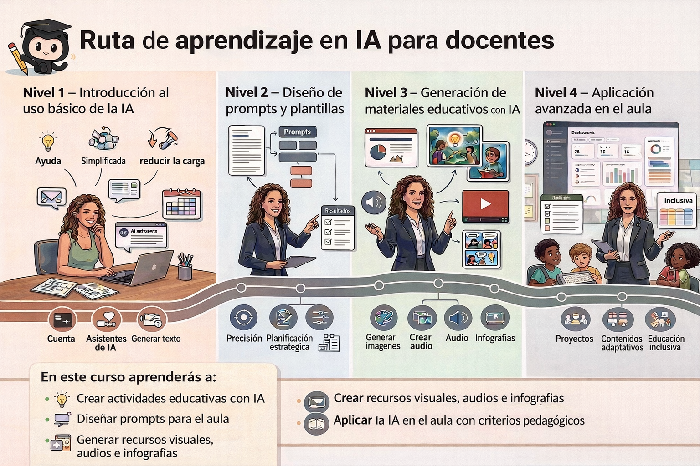

# 🎓 Herramientas de IA Generativa para Docentes
{: .fs-9 }

**Código:** 26IA92IN017 · **Modalidad:** Semipresencial · **Horas:** 30h (20h en línea + 10h síncronas)
{: .fs-5 .fw-300 }

---

## Presentación

Bienvenido/a al curso **"Herramientas de IA Generativa para Docentes"**.

A lo largo de este recorrido aprenderás a integrar la inteligencia artificial en tu práctica docente con sentido pedagógico, utilizando herramientas útiles para resolver tareas reales del día a día: desde la redacción de documentos hasta el diseño de actividades y materiales.

El curso está planteado de forma progresiva, comenzando por usos sencillos y avanzando hacia aplicaciones más complejas, siempre con un enfoque práctico, seguro y adaptado al contexto educativo.

> 💡 **No necesitas experiencia previa con IA para seguir el curso.**



## Qué te llevarás de este curso

A lo largo del curso aprenderás a utilizar la IA generativa de forma práctica, segura y conectada con la realidad del aula. En concreto, trabajarás para:

- **Ahorrar tiempo en tareas docentes habituales**, como la redacción de documentos, la organización de materiales o la preparación de instrumentos de evaluación.
- **Diseñar actividades y recursos más variados e inclusivos**, incorporando apoyos textuales, visuales y audiovisuales adaptados a diferentes perfiles de alumnado.
- **Usar la IA con criterio pedagógico y seguridad**, priorizando la protección de datos, la revisión crítica de los resultados y su aplicación real en el contexto educativo.

> ⚠️ **Uso seguro de la IA en el curso**
>
> La herramienta prioritaria del curso es **Microsoft Copilot con tu cuenta @edu.gva.es**.
>
> En herramientas externas: **nunca introduzcas datos personales del alumnado ni información sensible del centro**.

---

## 📅 Calendario de sesiones síncronas

Todas las sesiones se realizan en horario de **17:30 h a 20:00 h** a través de la sala virtual del curso en Aules.

| Sesión | Fecha | Bloque | Contenido clave |
|:------:|:-----:|:------:|:----------------|
| 1 | **22/04/2026** | Bloque 1 | IA Colaborativa y Gestión GVA: Copilot para actas, correos y organización del aula |
| 2 | **29/04/2026** | Bloque 2 | Prompting Avanzado y Gestión Documental: el "Prompt Pedagógico" y NotebookLM |
| 3 | **06/05/2026** | Bloque 3 | Generación Multimodal: presentaciones, cómics, audio y vídeo educativo |
| 4 | **13/05/2026** | Bloque 4 | Evaluación y Personalización: rúbricas LOMLOE, adaptaciones y ética |

---

## 🗂️ Estructura de bloques

| Bloque | Título | Enlace |
|:------:|:-------|:-------|
| 1 | IA Colaborativa y Gestión GVA | [Ir al Bloque 1](bloque1.md) |
| 2 | Prompting Avanzado y Gestión Documental | [Ir al Bloque 2](bloque2.md) |
| 3 | Generación Multimodal | [Ir al Bloque 3](bloque3.md) |
| 4 | Evaluación y Personalización | [Ir al Bloque 4](bloque4.md) |
| 📄 | Guía didáctica del curso | [Ver guía didáctica](guia-didactica.md) |

---

## 🚀 Primeros pasos antes de la primera sesión

Para aprovechar el curso desde el primer día, sigue estos pasos:

1. **Accede a Microsoft Copilot**  
   Entra en [copilot.microsoft.com](https://copilot.microsoft.com) e inicia sesión con tu cuenta **@edu.gva.es**.

2. **Comprueba que estás en entorno protegido**  
   Debes ver la insignia 🛡️ **"Protegido"** o "Protected" en la pantalla.

3. **Haz una prueba rápida**  
   Escribe un mensaje sencillo (por ejemplo: *"¿Cómo puede ayudar la IA a un docente?"*) y comprueba que recibes respuesta.

4. **Accede a Aules**  
   Utiliza la plataforma del curso para seguir las sesiones y entregar actividades.

### ❗ Si tienes problemas de acceso

- No aparece "Protegido" → cierra sesión y vuelve a entrar con tu cuenta @edu.gva.es  
- No puedes acceder → contacta con el SAI de tu centro  
- Mientras tanto → puedes usar [Gemini](https://gemini.google.com) con una cuenta personal

Las demás herramientas del curso (**Gemini**, **NotebookLM**, **Kimi**, **Grok**) se irán presentando progresivamente en cada bloque. No necesitas crear cuentas en todas antes de empezar.

## 🧪 Tarea 0 · Tu primera interacción con la IA

Antes de la primera sesión, realiza esta pequeña prueba.

No se trata de hacerlo perfecto, sino de tener tu **primer contacto real con la IA** y comprobar cómo responde a una tarea docente sencilla.

Esta actividad servirá como punto de partida para el Bloque 1.

Copia el siguiente prompt en **Microsoft Copilot** (con tu cuenta `@edu.gva.es`):

```text
Actúa como un asistente pedagógico para un/a docente de la Comunitat Valenciana.

Contexto: Soy profesor/a y estoy empezando un curso de formación sobre IA 
generativa. Quiero verificar que esta herramienta funciona correctamente 
con mi cuenta corporativa.

Tarea: Redacta un breve mensaje de bienvenida (5 líneas) que yo podría 
enviar a las familias de mi tutoría al inicio del tercer trimestre. 
El tono debe ser cercano pero profesional.
```

Si obtienes un mensaje coherente, tu acceso funciona correctamente.

Guarda el resultado: lo utilizaremos en la primera sesión para mejorar la calidad de las respuestas de la IA.

> Durante el curso aprenderás a dar instrucciones claras a la IA para obtener respuestas más útiles y adaptadas a tu práctica docente.

---

## ▶️ Siguiente paso

Ya puedes:

- Acceder a Aules  
- Completar la Tarea 0  
- Prepararte para la primera sesión  

Nos vemos en el inicio del curso.

---

<p style="text-align:center; color:gray; font-size:0.85em;">
Curso organizado por el CEFIRE de IA y Pensamiento Computacional · 2026<br>
Contenido bajo licencia <a href="https://creativecommons.org/licenses/by-sa/4.0/">CC BY-SA 4.0</a>
</p>