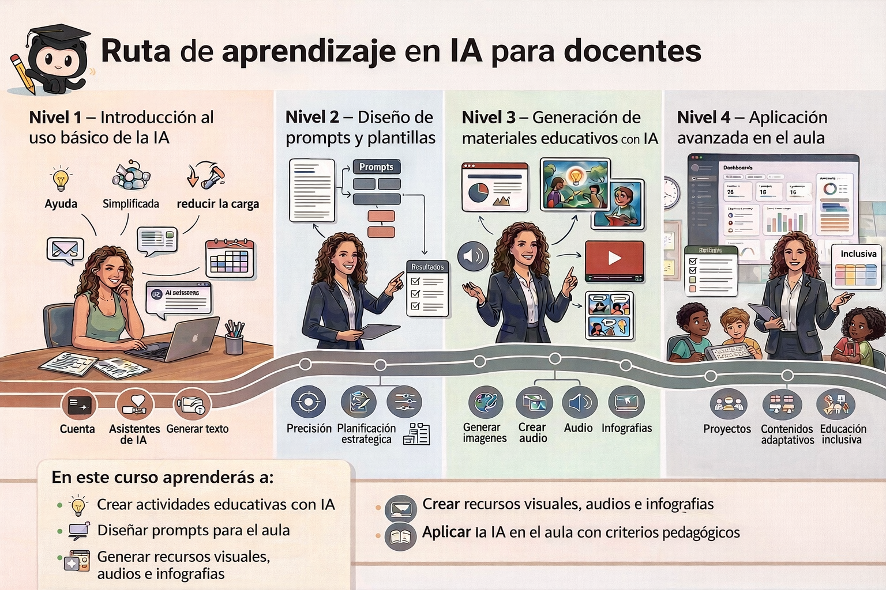

<br>


<!-- ═══════════════════════════════════════════════════════════════════
     FICHA DEL CURSO — actualizar solo aquí cuando cambie la edición
     ═══════════════════════════════════════════════════════════════════ -->
<p style="font-size:0.92em; color:#555; margin-bottom:1.5rem;">
  <strong>Código:</strong> 26IA92IN017 &nbsp;·&nbsp;
  <strong>Modalidad:</strong> Semipresencial &nbsp;·&nbsp;
  <strong>Duración:</strong> 32 horas &nbsp;·&nbsp;
  <strong>Edición:</strong> 2025-2026
</p>
<!-- ═══════════════════════════════════════════════════════════════════ -->

---

## Presentación

Bienvenido/a al curso **"Herramientas de IA para Docentes"**.

Aprenderás a integrar la inteligencia artificial en tu práctica docente con criterio pedagógico, usando herramientas que resuelven tareas reales del día a día: desde la preparación de documentos y actividades hasta la creación de recursos multimodales y la personalización del aprendizaje.

El curso es progresivo y completamente práctico. No necesitas conocimientos previos.

> **Las herramientas centrales del curso son Copilot Chat, NotebookLM y Canva.** Todas tienen modalidad gratuita. Consulta la [tabla de herramientas actualizadas](herramientas-ia-actualizadas.md) para detalles de acceso y privacidad.



---

## Qué te llevarás de este curso

Al terminar el curso sabrás:

- **Ahorrar tiempo en tareas docentes habituales**: redacción de documentos, preparación de evaluaciones, correos a familias.
- **Diseñar actividades y recursos más variados e inclusivos**, adaptados a diferentes perfiles y necesidades del alumnado.
- **Usar la IA con criterio**: saber cuándo aporta valor real y cuándo no es la mejor opción.
- **Proteger la privacidad** del alumnado y actuar dentro del marco legal (RGPD, Reglamento IA UE).

{: .callout .callout--reflexion }
**Para pensar antes de empezar**
La IA puede facilitar muchas tareas docentes, pero no siempre es la mejor herramienta. Parte del uso responsable consiste en decidir cuándo aporta valor real... y cuándo es mejor no usarla. En este curso practicaremos ese juicio.

---

## Estructura del curso

| Módulo | Horas | Contenido |
|--------|:-----:|-----------|
| **Módulo 0** · Entender la IA en 2026 | 2 h | Cómo funciona la IA hoy, qué ha cambiado, alucinaciones, sesgos, marco legal |
| **Bloque 1** · IA Colaborativa y Gestión GVA | 8 h | Copilot Chat, prompting eficaz, actas, correos, inclusión, privacidad |
| **Bloque 2** · Investigar, comprender y trabajar con fuentes | 8 h | NotebookLM, Deep Research, verificación, contraste, transformación curricular |
| **Bloque 3** · Creación multimodal | 7 h | Imagen, audio y vídeo educativo con IA; Canva, ElevenLabs, Google Labs |
| **Bloque 4** · Evaluación y personalización | 7 h | Rúbricas, adaptaciones, DUA, alfabetización del alumnado, proyecto final |

---

## Calendario de sesiones síncronas

Todas las sesiones son de **17:30 a 19:30 h** a través de la sala virtual del curso en Aules.

<!-- ═══════════════════════════════════════════════════════════════════
     CALENDARIO — actualizar aquí en cada edición
     ═══════════════════════════════════════════════════════════════════ -->

| Sesión | Fecha | Bloque | Contenido clave |
|:------:|:-----:|:------:|:----------------|
| 1 | **22/04/2026** | Bloque 1 | Copilot Chat para actas, correos y organización del aula |
| 2 | **29/04/2026** | Bloque 2 | NotebookLM, fuentes curriculares, Deep Research y verificación |
| 3 | **06/05/2026** | Bloque 3 | Generación multimodal: imagen, audio y vídeo |
| 4 | **13/05/2026** | Bloque 4 | Evaluación, personalización y ética con el alumnado |

<!-- ═══════════════════════════════════════════════════════════════════ -->

---

## Primeros pasos antes de la primera sesión

### 1 · Identidad digital y acceso

Antes de nada asegúrate de poder acceder a las plataformas del curso. Consulta la [guía de identidad digital](primeros-pasos/identidad-digital.md).

### 2 · Acceder a Copilot Chat

{: .callout .callout--privacidad }
**Antes de usar Copilot en el aula, comprueba en tu cuenta**
Existen dos productos distintos con el nombre "Copilot": **Copilot Chat** (gratuito, accesible en [copilot.microsoft.com](https://copilot.microsoft.com)) y **Microsoft 365 Copilot** (de pago, integrado en Word/PPT/Excel). En este curso usamos **Copilot Chat**.
La disponibilidad con tu cuenta `@edu.gva.es` depende de la configuración del tenant de tu centro. **Compruébalo tú mismo antes de la primera sesión.**

**Pasos para verificar:**
1. Ve a [copilot.microsoft.com](https://copilot.microsoft.com) e inicia sesión con tu cuenta `@edu.gva.es`.
2. Si funciona: escribe una pregunta de prueba (por ejemplo: *"Explica qué es la inteligencia artificial en dos líneas"*).
3. Si no funciona o ves un mensaje de error: usa [Gemini](https://gemini.google.com) con una cuenta Google personal como alternativa gratuita para las actividades del curso. Todas las actividades tienen ruta gratuita.

### 3 · Tu primera interacción con la IA

Antes de la primera sesión, prueba este prompt en Copilot Chat (o Gemini si Copilot no está disponible en tu cuenta):

```
Actúa como un asistente pedagógico.

Contexto: Soy docente de [tu etapa y asignatura].

Tarea: Redacta un breve mensaje de bienvenida (4-5 líneas) para enviar a las familias al inicio del trimestre. Tono cercano y profesional.
```

Guarda el resultado. Lo usaremos en la primera sesión para analizar cómo mejorar los prompts.

---

## Recursos del curso

<div style="background-color:#f5f0fa; border-left:4px solid #7b1fa2; padding:12px 14px; margin:18px 0; border-radius:6px;">
🔧 <strong>Herramientas actualizadas</strong><br>
Tabla de referencia con todas las herramientas del curso: plan gratuito, límites, privacidad y enlace oficial.
<br><br>
<a href="{{ '/herramientas-ia-actualizadas' | relative_url }}" style="font-weight:700; color:#7b1fa2;">→ Ver tabla de herramientas</a>
</div>

<div style="background-color:#f5f0fa; border-left:4px solid #7b1fa2; padding:12px 14px; margin:18px 0; border-radius:6px;">
💻 <strong>Vibe Coding Educativo</strong><br>
Crea aplicaciones educativas interactivas conversando con la IA, sin necesidad de programar.
<br><br>
<a href="{{ '/vibe-coding-educativo' | relative_url }}" style="font-weight:700; color:#7b1fa2;">→ Explorar Vibe Coding</a>
</div>

<div style="background-color:#f0f7f0; border-left:4px solid #388e3c; padding:12px 14px; margin:18px 0; border-radius:6px;">
🎓 <strong>Banco de Gems/GPTs educativos</strong><br>
Agentes de IA especializados organizados por etapas, listos para probar y adaptar.
<br><br>
<a href="{{ '/banco-gems-gpts-educativos' | relative_url }}" style="font-weight:700; color:#388e3c;">→ Explorar el banco</a>
</div>

---

<p style="text-align:center; color:gray; font-size:0.85em;">
Curso organizado por el CEFIRE de IA y Pensamiento Computacional · 2026<br>
Contenido bajo licencia <a href="https://creativecommons.org/licenses/by-sa/4.0/">CC BY-SA 4.0</a>
</p>


