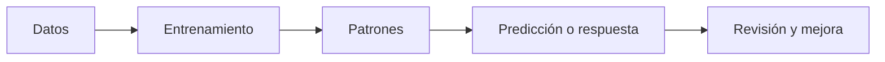
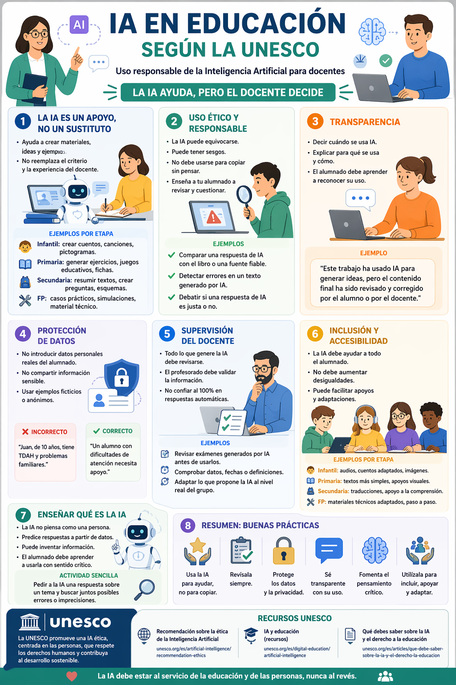

# Módulo 0: ¿Qué es la IA?

Antes de empezar a usar herramientas como Copilot, ChatGPT, Gemini o NotebookLM, conviene detenerse un momento en una pregunta básica: **qué entendemos realmente por inteligencia artificial**.

Este módulo sirve para construir una base común. No busca convertirnos en especialistas técnicos, sino ayudarnos a comprender **qué hace la IA, qué no hace y por qué esto importa en educación**.

> **Idea clave**
> Entender qué es la IA permite usarla mejor, con más criterio y con expectativas más realistas.

---

## 1. ¿Qué entendemos por inteligencia artificial?

Cuando hablamos de **inteligencia artificial**, nos referimos a sistemas capaces de realizar tareas que solemos asociar con capacidades humanas, como:

* reconocer patrones;
* clasificar información;
* generar texto;
* resumir documentos;
* traducir;
* recomendar contenidos;
* hacer predicciones a partir de datos.

Eso no significa que una IA **piense como una persona**. Significa, más bien, que puede producir resultados que, desde fuera, parecen “inteligentes”.

En educación, esto se traduce en acciones como:

* resumir un texto largo;
* adaptar una explicación a una edad concreta;
* generar preguntas tipo test;
* proponer una rúbrica;
* reorganizar información;
* sugerir ideas para actividades.

> **Para recordar**
> La IA no es magia. Es una tecnología capaz de aprender patrones y producir respuestas útiles a partir de datos.

---

## 2. Programa tradicional vs inteligencia artificial

No todo el software funciona igual.

### Programa tradicional

Un programa tradicional sigue **reglas fijas**.
Hace exactamente lo que se le ha indicado.

Ejemplo:

* si una contraseña no coincide, no entra;
* si una celda cumple una condición, muestra un resultado;
* si pulsamos un botón, ejecuta una acción concreta.

### Sistema con IA

La IA, en cambio, no depende solo de reglas escritas una a una.
Puede **aprender a partir de ejemplos**, detectar patrones y producir resultados aunque no se haya programado cada caso de forma explícita.

### Comparativa rápida

| Aspecto                     | Programa tradicional                | Sistema con IA                              |
| --------------------------- | ----------------------------------- | ------------------------------------------- |
| Funcionamiento              | Sigue reglas fijas                  | Aprende patrones a partir de datos          |
| Flexibilidad                | Baja                                | Mayor                                       |
| Ejemplo típico              | Calculadora, formulario, validación | Recomendador, traductor, generador de texto |
| Respuesta ante casos nuevos | Limitada                            | Puede generalizar                           |
| Base del sistema            | Instrucciones exactas               | Datos + entrenamiento + modelo              |

> **Ejemplo cotidiano**
> Una calculadora suma porque alguien escribió la regla. Un teclado predictivo sugiere palabras porque ha aprendido patrones de lenguaje.

---

## 3. La IA aprende con ejemplos

Una manera sencilla de entender la IA es compararla con **un niño que aprende**.

Un niño no nace sabiendo leer, clasificar animales o resolver problemas. Aprende poco a poco:

1. ve ejemplos;
2. prueba;
3. se equivoca;
4. recibe corrección;
5. mejora.

Con la IA ocurre algo parecido: se le muestran muchos ejemplos y, a partir de ellos, aprende regularidades.

### Esquema simple

| Paso        | Qué ocurre                                             |
| ----------- | ------------------------------------------------------ |
| Ve ejemplos | Recibe muchos datos: textos, imágenes, audios, números |
| Se equivoca | Sus primeras respuestas no son precisas                |
| Corrige     | El entrenamiento ajusta el modelo                      |
| Mejora      | Aprende patrones y responde cada vez mejor             |

> **Idea clave**
> La IA no aprende “entendiendo” como una persona. Aprende **detectando patrones** en muchísimos ejemplos.

---

## 4. ¿Cómo funciona por dentro?

Aunque no necesitamos una explicación técnica profunda para usarla en el aula, sí conviene comprender sus componentes básicos.

### Datos

La IA aprende a partir de datos:

* textos;
* imágenes;
* audios;
* vídeos;
* números;
* documentos.

Los datos son, por decirlo de manera simple, la “experiencia” de la que aprende el sistema.

### Algoritmos

Los algoritmos son los procedimientos matemáticos que permiten procesar esos datos y buscar regularidades.

### Entrenamiento

Durante el entrenamiento, el sistema ajusta sus parámetros para mejorar sus resultados. En ese proceso compara respuestas, detecta errores y corrige.

### Patrones

Tras procesar muchísimos ejemplos, la IA aprende patrones:

* qué palabras suelen ir juntas;
* qué rasgos se repiten en una imagen;
* qué estructura suele tener una respuesta;
* qué tipo de salida es más probable.

### Predicción

Con esos patrones, el sistema genera una respuesta o una predicción.

### Mejora

Cuantos más datos, ajustes y entrenamiento adecuados tiene el sistema, mejores suelen ser sus resultados.

### Flujo básico

> **Ojo**
> Que una respuesta suene convincente no significa que sea correcta. La IA puede producir textos muy plausibles y, aun así, equivocarse.

---

## 5. Ejemplos cotidianos de IA

La IA no aparece solo en herramientas “nuevas”. Ya forma parte de muchas tecnologías cotidianas.

### Algunos ejemplos frecuentes

* **Recomendaciones** en Netflix, YouTube o Spotify.
* **Teclado predictivo** en el móvil.
* **Asistentes de voz** como Siri, Alexa o Google Assistant.
* **Mapas y navegación**, que sugieren rutas.
* **Filtros de spam** en el correo.
* **Traducción automática**.
* **Subtítulos automáticos**.
* **Reconocimiento de voz** al dictar mensajes.

### Conexión con el día a día docente

Muchos docentes ya conviven con IA sin llamarla así:

* cuando el correo separa spam;
* cuando el móvil sugiere palabras;
* cuando una plataforma recomienda contenidos;
* cuando un traductor automático ayuda a preparar materiales.

> **Para el aula**
> Usar IA no equivale solo a usar ChatGPT. Muchas herramientas que ya utilizamos incorporan IA desde hace años.

---

## 6. Resumen en una frase

> **La IA es un sistema capaz de aprender patrones a partir de datos para generar respuestas, clasificar información o hacer predicciones.**

También podemos decirlo así:

> **La IA no sigue solo reglas fijas: aprende de ejemplos, detecta patrones y produce resultados útiles en tareas concretas.**

---

## 7. Tipos de IA

No toda la IA es igual. Una forma habitual de clasificarla distingue entre **IA débil**, **IA general** e **IA superinteligente**.

### Tabla comparativa

| Tipo de IA          | Qué es                                                                | ¿Existe hoy? | Ejemplos                                         | Nivel de realidad actual         |
| ------------------- | --------------------------------------------------------------------- | ------------ | ------------------------------------------------ | -------------------------------- |
| IA débil o estrecha | Diseñada para tareas concretas                                        | Sí           | asistentes, recomendadores, generadores de texto | Es la IA real de hoy             |
| IA general (AGI)    | Sería capaz de aprender y realizar cualquier tarea intelectual humana | No           | No hay ejemplos reales                           | Sigue siendo un objetivo teórico |
| IA superinteligente | Superaría ampliamente la capacidad humana                             | No           | No existe                                        | Es una hipótesis teórica         |

### Lo importante para este curso

La inmensa mayoría de herramientas que hoy usamos en educación son **IA débil**:

* hacen algunas cosas muy bien;
* no lo hacen todo;
* no entienden el mundo como una persona;
* no tienen conciencia.

> **Idea clave**
> ChatGPT, Copilot, Gemini o NotebookLM no son una “mente general”. Son herramientas potentes, pero especializadas.

---

## 8. Dentro de la IA actual: la IA generativa

Dentro de la IA actual hay un grupo especialmente relevante: la **IA generativa**.

Se llama así porque puede **generar contenido nuevo** a partir de los patrones aprendidos.

### ¿Qué puede generar?

* texto;
* resúmenes;
* esquemas;
* preguntas;
* imágenes;
* código;
* reformulaciones;
* traducciones;
* propuestas de actividades.

### Por qué importa en educación

La IA generativa resulta útil porque puede:

* adaptar una explicación a una edad concreta;
* proponer ejemplos;
* transformar apuntes en preguntas;
* resumir información;
* ayudar a crear materiales.

> **Ejemplo cotidiano**
> Cuando una herramienta redacta un correo, resume un documento o propone una explicación paso a paso, normalmente estamos ante usos de IA generativa.

---

## 9. Las herramientas que veremos en el curso

A continuación se resumen algunas herramientas relevantes en el ecosistema actual. Todas pertenecen a la IA actual; muchas de ellas son IA generativa y casi todas encajan en lo que llamamos **IA débil**.

| Herramienta       | Uso principal                                      | Punto fuerte                      | Mejor para                                           | Limitación                                                     |
| ----------------- | -------------------------------------------------- | --------------------------------- | ---------------------------------------------------- | -------------------------------------------------------------- |
| ChatGPT           | conversación, redacción, explicación               | versatilidad                      | explicar, crear materiales, reformular               | necesita revisión y puede inventar datos                       |
| Microsoft Copilot | asistencia integrada en ecosistema Microsoft       | integración con entorno Microsoft | productividad docente, documentos, tareas cotidianas | depende mucho del contexto y del entorno                       |
| Gemini            | trabajo integrado con servicios de Google          | ecosistema Google                 | documentos, Gmail, apoyo general                     | calidad variable según tarea                                   |
| NotebookLM        | trabajo con documentos propios                     | responde desde tus fuentes        | apuntes, PDFs, síntesis y estudio documental         | depende de la calidad de los documentos subidos                |
| Grok              | consulta con foco en actualidad y tono más directo | información reciente              | tendencias y actualidad                              | no siempre es la mejor opción para tareas didácticas profundas |
| Kimi              | lectura de textos largos                           | manejo de gran volumen de texto   | documentos extensos                                  | menos extendida en entornos educativos                         |

### Una aclaración importante

En este curso tiene especial relevancia **Microsoft Copilot**, porque se trabaja en relación con el entorno institucional y la productividad docente. Pero conviene entenderlo dentro del conjunto: **no es “la IA”, sino una herramienta concreta dentro del ecosistema de IA actual**.

> **Para recordar**
> No hay una única herramienta “mejor” para todo. La elección depende de la tarea, del contexto y del criterio docente.

---

## 10. Lo que la IA actual NO hace

Las herramientas actuales son útiles, pero tienen límites importantes. Conviene conocerlos para no pedirles más de lo que realmente pueden ofrecer.

### Qué sí hace la IA actual y qué no hace

| Qué sí hace                                  | Qué no hace                            |
| -------------------------------------------- | -------------------------------------- |
| Resume información                           | No tiene conciencia                    |
| Genera texto, esquemas o ideas               | No comprende el mundo como una persona |
| Clasifica, reorganiza y transforma contenido | No tiene criterio pedagógico propio    |
| Detecta patrones en muchos datos             | No garantiza siempre veracidad         |
| Adapta tono o nivel de explicación           | No sustituye la revisión docente       |
| Puede ahorrar tiempo                         | No reemplaza la relación educativa     |

### Riesgos habituales

* puede equivocarse;
* puede omitir matices importantes;
* puede inventar referencias o datos;
* puede dar una respuesta convincente pero incorrecta;
* puede simplificar en exceso.

> **Ojo**
> La IA no “sabe” que se equivoca. Por eso la supervisión humana es imprescindible.

---

## 11. Qué significa esto para un docente

En educación, la IA puede ser una ayuda muy valiosa, pero siempre debe situarse como **herramienta de apoyo**, no como sustituto del profesorado.

### Puede ayudarte a:

* ahorrar tiempo en tareas repetitivas;
* generar borradores de materiales;
* adaptar explicaciones a distintos niveles;
* resumir documentos;
* transformar contenidos;
* proponer ejemplos, actividades o preguntas;
* organizar ideas de forma más rápida.

### Pero sigue siendo imprescindible el papel docente para:

* decidir qué tiene sentido enseñar;
* adaptar al contexto real del aula;
* detectar errores o sesgos;
* valorar si un material es pedagógicamente adecuado;
* acompañar, motivar y orientar al alumnado;
* cuidar la dimensión ética y humana del aprendizaje.

> **Para el aula**
> La IA puede ayudarte a preparar mejor una clase. Pero explicar bien, conectar con el alumnado y tomar decisiones educativas sigue siendo tarea del docente.

## 🌍 La IA en educación: marco de referencia (UNESCO)

> **Resumen visual del enfoque UNESCO sobre IA en educación**

    

La incorporación de la inteligencia artificial en la educación no es solo una cuestión técnica. Implica también reflexión pedagógica, ética y profesional. Por eso, organismos internacionales como la UNESCO han desarrollado marcos de referencia para orientar a los sistemas educativos y al profesorado.

La UNESCO ha publicado el **Marco de competencias para docentes en materia de IA**, que define los conocimientos, habilidades y valores que el profesorado necesita para desenvolverse con criterio en la era de la inteligencia artificial.

Este marco identifica cinco dimensiones clave, que se traducen en retos y oportunidades concretas para la práctica docente:

| Dimensión UNESCO                        | ¿Qué significa en el aula?                                  |
| ---------------------------------------- | ---------------------------------------------------------- |
| Enfoque centrado en el ser humano        | Poner siempre a las personas y al alumnado en el centro    |
| Ética de la IA                           | Usar la IA de forma responsable, segura y transparente     |
| Fundamentos y aplicaciones de la IA      | Comprender cómo funciona y para qué sirve la IA            |
| Pedagogía de la IA                       | Integrar la IA en la enseñanza de manera didáctica         |
| IA para el aprendizaje profesional       | Usar la IA para mejorar la formación y el desarrollo docente|

Estas competencias se desarrollan en tres niveles de progresión: **adquirir**, **profundizar** y **crear**.

> **Idea clave**
> No basta con saber usar herramientas de IA: lo importante es saber cuándo, cómo y para qué utilizarlas en educación.

**Enlaces de interés:**

- [Marco de competencias para docentes en materia de IA (UNESCO, español)](https://www.unesco.org/es/articles/marco-de-competencias-para-docentes-en-materia-de-ia)
## 12. Idea final

> **La mejor combinación no es IA o docente. La mejor combinación es IA + criterio docente.**

La tecnología puede acelerar procesos, generar propuestas y facilitar tareas. Pero el valor educativo sigue estando en la mirada profesional del profesorado:

* qué selecciona;
* cómo acompaña;
* cómo interpreta;
* cómo contextualiza;
* cómo transforma una herramienta en aprendizaje real.

---

## 13. Actividad breve opcional

### Actividad de inicio

Piensa en tres situaciones de tu día a día docente en las que ya aparezca algún tipo de IA, aunque no la llames así.

Por ejemplo:

* filtro de correo;
* traducción automática;
* recomendaciones de vídeos;
* teclado predictivo;
* asistentes de voz;
* herramientas que resumen documentos.

Después, responde:

1. ¿Qué hace exactamente la herramienta?
2. ¿Te ahorra tiempo, te orienta o toma decisiones por ti?
3. ¿Qué revisión humana sigue siendo necesaria?

---

## 14. Siguiente paso

Ahora que ya tienes una base clara sobre qué es la IA y qué límites tiene, el siguiente paso es empezar a trabajar con herramientas concretas en contexto educativo.

[Ir al Bloque 1](bloque1.html)

---

## Ideas clave del módulo

* La IA aprende patrones a partir de datos.
* No funciona igual que un programa tradicional.
* Muchas herramientas cotidianas ya usan IA.
* La mayoría de IAs actuales son **IA débil**.
* Muchas de las herramientas que usamos hoy son **IA generativa**.
* La IA puede ser muy útil, pero también equivocarse.
* En educación, el criterio docente sigue siendo imprescindible.
